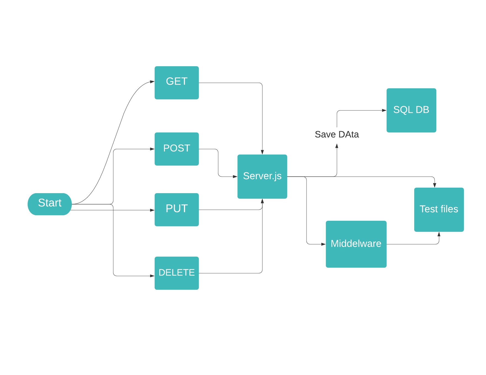

# sql-api-server

## Author: Alaa Abu Issa
Requirement
we will be building an Api server using best practices, including server modularization, use of middleware, and tests.

## UML

## LINKS :
Heroku URL : https://alaa-sql-api.herokuapp.com/

Github Actions : https://github.com/Alaa-AbuIssa/sql-api-server/actions

Pull Request: https://github.com/Alaa-AbuIssa/api-server/pull/1